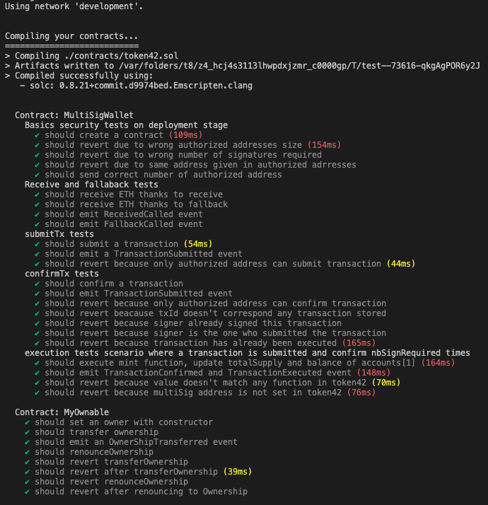
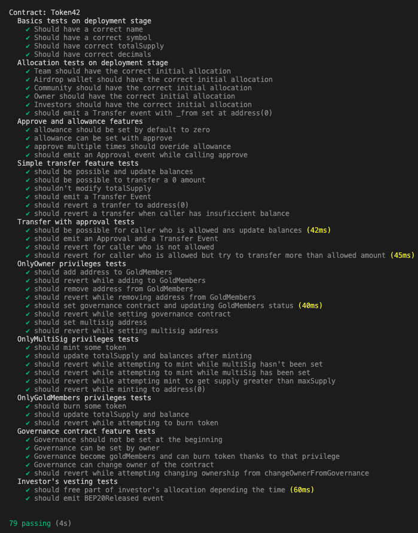
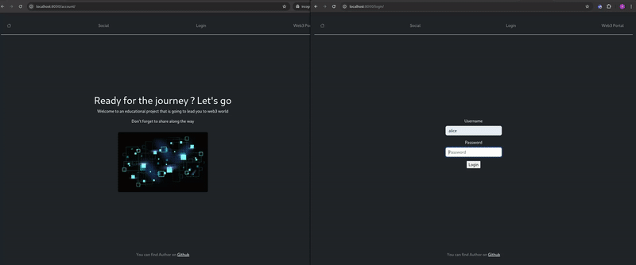

# Tokenizer

## Overview 🧾
This project focuses on the creation of a BEP-20 token.

The main goals are to dig blockchain technology, understand and know how to implment smart contracts, Dapp, understand web3 projects.

## Network 🌐
I chose to use the BNB Smart Chain Testnet, which I had to manually add to my Rabby Wallet. 

BNB Smart Chain Testnet is the official test version of BSC and it is compatible with a lot of tools such as Truffle, Alchemy services..

To interact with this network and pay transaction gas fees, I needed tBNB (the testnet version of BNB). I obtained this via a faucet available on the BNB Discord server.

## Programming language 💻
I used Solidity to write the smart contract, as the BSC is EVM-compatible.

Solidity is the primary programming language for developing smart contract, and is well documented.

## Web3 Framework Platfrom 🧰
I chose Truffle as the Web3 framework for this project. Having previously worked with Hardhat and Remix, I wanted to explore Truffle's features.
Truffle handles the complete cycle with compilation, migration, deployment, tests and interaction.
Truffle is a node.js based development framework for Ethereum-compatible blockchains that:
- Manages smart contract deployment with a migration system
- Supports JavaScript or Solidity-based testing using Mocha and Chai
- Provides a local blockchain environment (via Ganache)
- Offers a console and scripting interface to interact with the blockchain

## Web3 library 📚
I used two different Web3 libraries:

- web3.js: Used within Truffle, since Truffle is built on top of web3.js. This allowed me to leverage its built-in scripting system for deployments and interactions without additional setup.
- ethers.js: Used in the DApp frontend. It is more modern, well-documented, and commonly preferred for client-side interaction.


## Blockchain Node 🛰️
To interact with a Blockchain, we need to have access to a blockchain Node.

I chose to use Alchemy, a blockchain node provider that simplifies access to various blockchain networks. 

Alchemy handles node infrastructure, allowing developers to focus on building DApps without managing their own nodes. It handles a lot of networks including BSCTestnet.

In this project, I configured the Truffle settings (truffle-config.js) to use the Alchemy RPC endpoint for the BNB Smart Chain Testnet.

## Tests 🧪
Unit and integration tests have been made in the Truffle test section.
These tests used Mocha (JavaScript test framework), Chai (assertion library) and @openzeppelin/test-helpers (test library)

Command to test (install dependencies with npm install): 
```bash
npx truffle test
```






## Token 🪙
EXTEND42 token aims to grow as the project progresses to educate its community on the life cycle of a web3 project. 

It will allows community to discover basics features of a BEP-20 Token such as transfer, approve, balances.

People implicated in the ecosystem will receive token by airdrop as schedule in the whitepaper. 

The token will be used to obtain certain privileges and buy services on the plateform.

The community will have an important role in the direction the project takes: it will have the opportunity to establish a governance that will take more power to decentralize the project, active members will be able to be GoldMembers which will allow them to burn tokens and have privileges to be determined on the platform.

To summarize, the token and the privileges will go in the direction of the community's choices which will allow it to understand the problems of a decentralized project.

Network used : 
- BNB Smart Chain Testnet (ChainID 97, Currency tBNB)
- Token contract : 
```plaintext
    0x21eA36E6120eEcfd62569B2a7e0201350473Ea55
```

## BEP-20 Standard documentation 📘

https://github.com/bnb-chain/BEPs/blob/master/BEPs/BEP20.md


## 👨‍💻 Dapp to interact with my smart contract token

Here a small project (back-end oriented) to interact with the smart contract. This app allows user to :
- Login/logout
- Chat in real time with other user using WebSockets
- Interact with my token smart contrat to use basics features such as see balance in real time, transfer, approve and transfer From

### Dapp stack
- Front-end : HTML, Bootstrap, JavaScript (jQuery)
- Back-end : Python / Django
- Web3 : ethers.js




## Bonus - MultiSig 🔐
A multisignature contract (or multisig) is a security mechanism that requires multiple signatures (validations) for a transaction or critical action to be executed on the blockchain.

It's not designed to control everything, only high-impact actions. It's used for controlling critical functions on smart contract, securing asset for organization, companies, states or even individual, creating decentralized groups that takes fair decision together.
Gnosis Safe, Argent Wallet or OpenZepellin MultiSig are main available solutions today.

I chose to create a MultiSig contract that is extensible for multiple used case. That's the reason why I added receive and fallback funciton so that my contract can receive ETH or BNB to protect value. Thanks to these functions, the MultiSig contract can be used as a safe to lock value on it and use it only if preconfigured settings are filled.

In my case, I protect the mint of my token to assure that minting token is a decision approved by enough actors of the token ecosystem.

multiSig contract : 
```plaintext
    0xB4C3b9c2F27C1806EfAc3888658716738d6Ef5B4
```

